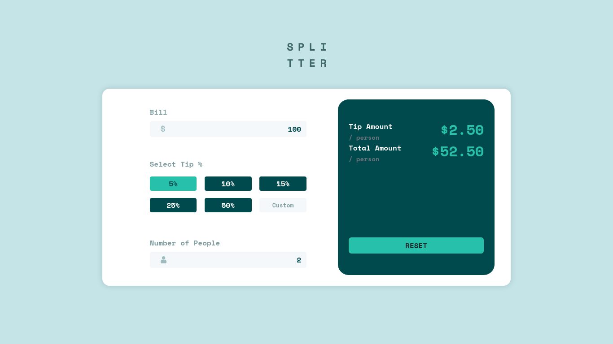

# Frontend Mentor - Tip calculator app solution

This is a solution to the [Tip calculator app challenge on Frontend Mentor](https://www.frontendmentor.io/challenges/tip-calculator-app-ugJNGbJUX). Frontend Mentor challenges help you improve your coding skills by building realistic projects.

## Table of contents

- [Overview](#overview)
  - [The challenge](#the-challenge)
  - [Screenshot](#screenshot)
  - [Links](#links)
- [My process](#my-process)
  - [Built with](#built-with)
  - [Useful resources](#useful-resources)
- [Author](#author)

**Note: Delete this note and update the table of contents based on what sections you keep.**

## Overview

### The challenge

Users should be able to:

- View the optimal layout for the app depending on their device's screen size
- See hover states for all interactive elements on the page
- Calculate the correct tip and total cost of the bill per person

### Screenshot



### Links

- Solution URL: [Click here](https://github.com/DOCSPLOIT/splitter/)
- Live Site URL: [Click here](https://docsploit.github.io/splitter/)

## My process

### Built with

- Semantic HTML5 markup
- CSS custom properties
- Flexbox
- Bootstrap
- [React](https://reactjs.org/) - JS library
- CSS Modules
- Formik and Yup

### What I learned

Better understanding of React context API.

To see how you can add code snippets, see below:

```js
const calculateAmount = (_tip?: any) => {
  const { bill, people } = formik.values;
  const tip = formik.values.tip ?? _tip;
  if (bill && people && tip) {
    const splitBill = +bill / +people;
    const tipAmount = splitBill * (+tip / 100);
    const totalAmount = splitBill + tipAmount;
    amountCtx.setAmounts(totalAmount.toFixed(2), tipAmount.toFixed(2));
  } else amountCtx.setAmounts(0, 0);
};
```

Here as you can see there is `_tip` parameter provided and also it is available in `formik.values`. I defined it this way because the tip component is custom made and not linked with any `HTMLEvent`. So formik cannot properly update value so we have to explicitly pass it function.

### Useful resources

- [React Context API](https://reactjs.org/docs/context.html) - Used to pass values through components.
- [Formik](https://formik.org/docs/overview) - Used for form validation

## Author

- Website - [Robert Devasia](https://docsploit.github.io)
- LinkedIn - [Robert Devasia](https://www.linkedin.com/in/robertdevasia/)
